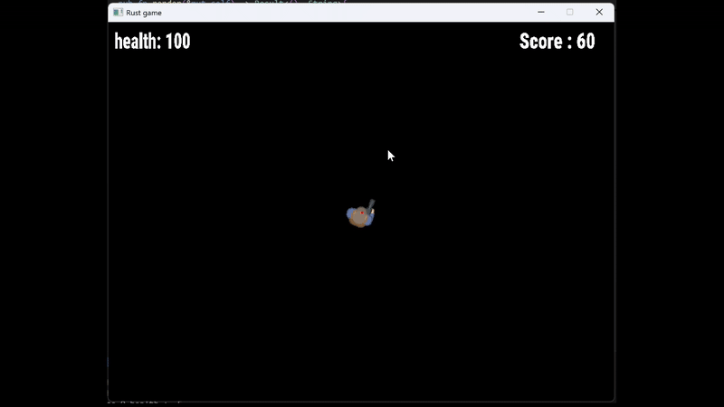

# 2D Top-Down Shooter – Rust + SDL2 (Work in Progress)

This project is a **2D top-down shooter game**, currently under development, built using the **Rust programming language** and the **SDL2** multimedia library.

The codebase adopts a modular architecture and serves as a hands-on project to deepen understanding and proficiency in Rust.

## Features

- **Player movement**, rotation, and input handling  
- **Shooting mechanics**, including bullet lifetime and directional logic  
- **Basic enemy AI**, featuring player tracking and melee attacks  
- A **damage and health system** for both the player and enemies  
- **Score tracking** with **dynamic difficulty scaling** based on gameplay progression  
- **Camera control**, object rendering, and **HUD display** using TTF font rendering  

## Notes

- This project is non-commercial and developed for educational purposes.  
- All game assets are sourced from [kenney.nl](https://kenney.nl) and used under their free asset license.

## TO DO

- far spawnare piu' nemici alla volta -> randomizzare il numero di nemici spawnati ed aumentarli nel tempo
- incrementare range di spawn, per ora troppo vicini al player
- Creare spawner generico, per enemy e per item che potenziano il player
- creare quindi item che potenziano il player in vari modi, item che possono essere raccolti e spawnano casualmente
- vari tipi di items con differenti tipi di effetti: + speed momentanea, + attacco...
---

